# OpenAI Chat API Workflow for Alfred

🎩 An [Alfred 5](https://www.alfredapp.com/) Workflow for using the [OpenAI](https://platform.openai.com/) Chat API to interact with GPT models 🤖💬. It also allows file understanding 📎 (images, PDFs, Office documents, code, and more), image generation 🖼️, speech-to-text conversion 🎤, and text-to-speech synthesis 🔈.

📦 Download [**OpenAI Chat API Workflow**](https://github.com/yohasebe/openai-chat-api-workflow/raw/main/openai-chat-api.alfredworkflow) (version `5.9.0`)

You can execute all the above features using:

- Alfred UI 🖥️
- Selected text 📝
- A dedicated web UI 🌐

The web UI is constructed by the workflow and runs locally on your Mac 💻. With the default settings, API calls go directly from the workflow to OpenAI, so your chat messages are not shared online with anyone other than OpenAI 🔒. By default, OpenAI does not use data sent through its API for training 🚫.

All messages in a conversation are displayed on a single scrollable page 📜, making it easy to review the full context. You can export the chat data to an external file in simple JSON format 📄, and it is possible to continue the chat by importing it later 🔄.

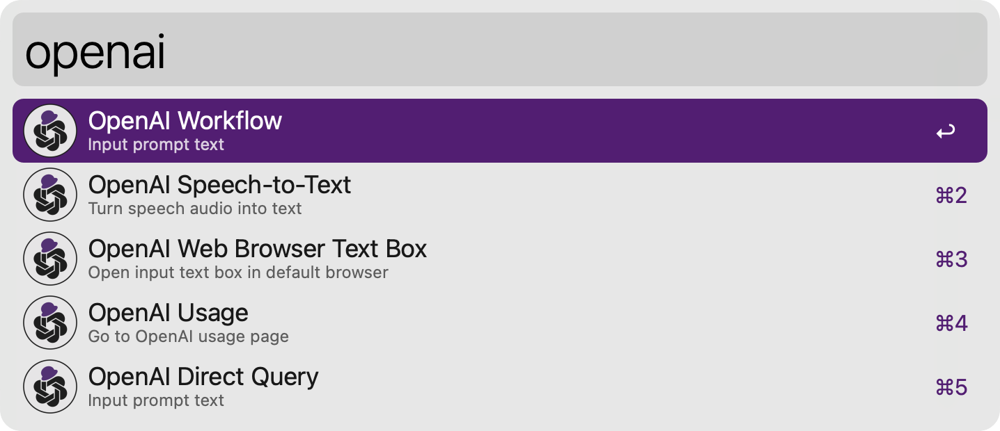

<kbd>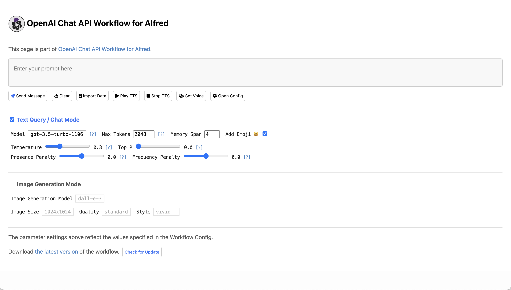</kbd>

<kbd>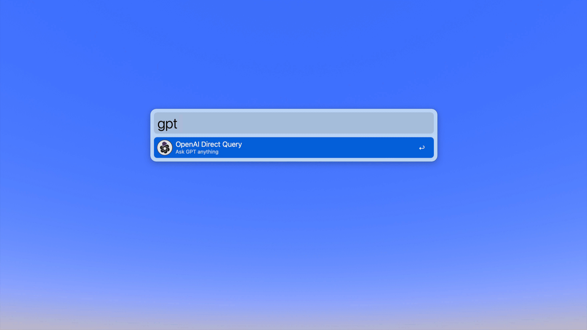</kbd>

## Installation

1. Download and run [**OpenAI Chat API Workflow**](https://github.com/yohasebe/openai-chat-api-workflow/raw/main/openai-chat-api.alfredworkflow)
2. Set your [OpenAI API key](https://platform.openai.com/account/api-keys)
3. Enable accessibility settings for Alfred in `System Preferences` → `Security & Privacy` → `Privacy` → `Accessibility`

<kbd>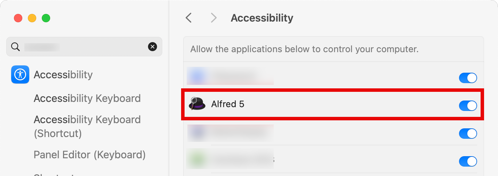</kbd>

**Setup Hotkeys**

You can set up hotkeys in the settings screen of the workflow. To set up hotkeys, double-click on the light purple workflow elements.

<kbd>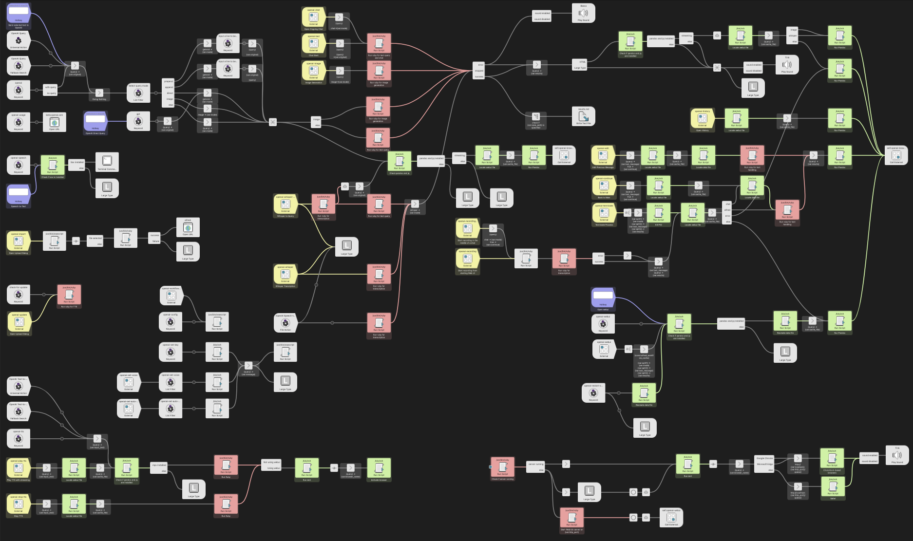</kbd>

1. Open Web UI (Recommended)
2. Direct Query
3. Send Selected Text
4. Screen Capture for Image Editing 
5. Screen Capture for Image Understanding
6. Speech to Text
7. Text to Speech (Selected text)

There is also a "Stop text-to-speech playback" command to stop the playback of the text-to-speech audio stream. Assign it a hotkey different from that of the "Text to Speech" command.

**Dependencies**

- Alfred 5 [Powerpack](https://www.alfredapp.com/shop/)
- OpenAI [API key](https://platform.openai.com/account/api-keys)

No external tools (Homebrew, etc.) are required for any feature except the terminal voice recorder started by the `openai-speech` keyword, which needs SoX. Voice input in the web UI needs nothing extra.

To start using this workflow, you must set the environment variable `apikey`, which you can obtain by creating a new [OpenAI account](https://platform.openai.com/account/api-keys). Once an API key has been saved in the workflow settings, you can also replace it with the keyword `openai-set-key` followed by the new key. See also the [Configuration Parameters](#configuration-parameters) section below.

> **Note:** Voice input uses the browser's built-in Web Audio API in the Web UI. No external dependencies are required.

**Recent Changelog**

- 5.9.0:
  - The API key setting can hold a 1Password reference (`op://…`) or a keychain reference (`keychain:<name>`) instead of the key itself
- 5.8.0:
  - New models `gpt-6.1-sol`, `gpt-6-sol` and `gpt-6-luna`; `gpt-6-luna` is the new default at less than half the price of the previous one
  - Fix: reasoning effort `none` was not applied (requests ran at `medium`)
  - Fix: continuing a saved conversation could resend a removed model or an unsupported effort
  - Fix: the 7-day cache cleanup no longer removes images from an image session that is still open
- 5.7.0:
  - New image models `gpt-image-2.5-flare` (now the default) and `gpt-image-2.5-sunburst`, with `xhigh` and `max` quality
  - Fix: voice input from the Web UI works again (broken since 5.0.0)
  - Fix: "high" image quality in the Alfred settings, and Edit Image ignoring the selected model
  - Removed transcription models that OpenAI is shutting down, and with them the `srt` / `vtt` formats. Audio to English now transcribes and then translates, which also works for Japanese
  - Fix: long conversations lost the system content, and answers could come back empty with a higher reasoning effort or with Stream output turned off
  - The Save folder setting now keeps copies of generated images too
  - A request that times out waiting for the response is no longer resent (chat requests used to be resent up to ten times)
- 5.6.0:
  - New model `gpt-6-astra` available as an option (the default remains `gpt-5.6-luna`, which is far cheaper)
  - Fix: translating an audio file failed unless the transcription model happened to be `whisper-1`, the only model that supports translation
  - Fix: passing a sound file from Finder or the Universal Action menu ignored the transcription model chosen in the settings
  - Fix: the Text-to-Speech and Transcription settings now fall back to a working model if they were left pointing at one that no longer exists
  - Fix: an image request that kept timing out never gave up
- 5.5.0:
  - Default chat model is now `gpt-5.6-luna` — a newer generation at about a quarter of the previous cost, with a 1M-token context window. Use `gpt-5.6-terra` for very large documents
  - Speech-to-text now defaults to `gpt-transcribe`, the current recommended transcription model
  - Reasoning effort `max` added for the GPT-5.6 models; the default effort is now `none` on a fresh install
  - Models that OpenAI has retired or scheduled for retirement were removed from the menus
  - The mode picker is a segmented control, and only the selected mode's settings are shown
  - Dark mode: code blocks inside a reply are visible again
  - Fixes: the response card no longer says "Assistant" twice; a stalled request now reports itself instead of failing silently; the progress indicator disappears when the answer is done; Memory Span no longer describes the wrong number
- 5.4.0:
  - Dark mode now follows the system appearance while the page is open, and both themes come from a single stylesheet
  - Layout rebuilt with flexbox: no more button labels breaking across two lines in a narrow window
  - Send with `⌘/Ctrl+Enter`; the response area says whether the model is waiting or thinking
  - Max Tokens explains why it is disabled for reasoning models
  - Clear Cache keeps the images your conversation still shows, and no longer breaks the page on reload
- 5.3.0:
  - No more CDN dependencies: Markdown rendering, syntax highlighting, and icons are bundled with the workflow and served locally
  - Voice recording now uses the browser's built-in recorder instead of an external polyfill
  - Removed the `check-for-update` keyword and the Web UI's Check for Update button; download the latest version from the link above
- 5.2.0:
  - New GPT-5.6 frontier models added: `gpt-5.6-sol` (flagship), `gpt-5.6-terra` (balanced), `gpt-5.6-luna` (cost-efficient)
  - All three support reasoning effort `none`/`low`/`medium`/`high`/`xhigh` (default: `none`) and a 1M-token context window
  - Default chat model remains `gpt-5.4-mini` (the GPT-5.6 family is priced above the mini tier)
  - Fix: `gpt-5.5` was missing from the web UI model dropdown
- 5.1.0:
  - New model `gpt-5.5` added as a selectable option (not the default)
  - Default chat model changed from `gpt-5-mini` to `gpt-5.4-mini` for a better balance of cost and capability
  - Removed unused expensive-model confirmation dialog mechanism (the `pro` flagship and o-series models are intentionally not bundled)
- 5.0.0:
  - New image generation model `gpt-image-2` (now default); simplified to `gpt-image-2` and `gpt-image-1.5`
  - File input via OpenAI Files API (`file_id` reference) for images, PDFs, Office documents, text, code, and more
  - Uploaded files are automatically deleted from OpenAI's storage after each response
  - Structured error display with Status/Code/Message/Request ID and collapsible debug info
  - File input via Alfred Universal Action ("OpenAI File Input") for all supported file types
  - Iterative image editing (Refine Image) with conversation history
  - Automatic context truncation for long conversations
  - Simplified command list: removed 12 legacy prompt modes (Write Program Code, Grammar Correction, etc.) — use natural language prompts instead
  - Removed unused API parameters (Temperature, Top P, Frequency/Presence Penalty, Max Size for Image Understanding) from settings
  - Unified file upload architecture: both starter and chat UIs now use WEBrick `/upload` endpoint
  - Improved WebSocket stability for large file uploads
  - JSON export/import reliability improvements
  - Cache management: auto-cleanup on server start (7+ days) and manual "Clear Cache" button
  - No external dependencies required (Homebrew install step removed)
- 4.8.0:
  - New models: `gpt-5.4-mini`, `gpt-5.4-nano`
  - Reasoning effort defaults optimized per model
- 4.7.0:
  - New models: `gpt-5.4`, `gpt-5.3-chat-latest`, `gpt-5.3-codex`
  - Removed deprecated models and added invalid model fallback
  - Fix outdated OpenAI documentation URLs
- 4.6.0:
  - Fix Large Type parallel firing issue on Alfred 5.7+ / macOS 16
  - Remove date-suffixed TTS/STT model names; use base names as defaults
  - Fix typo in JSON validation error message
- 4.5.0:
  - Simplified image models: `gpt-image-1.5` (default) and `chatgpt-image-latest` (lightweight)
  - Removed deprecated `gpt-image-1` and `gpt-image-1-mini` models
- 4.4.0:
  - Added `gpt-image-1.5` as default image generation model
  - Removed DALL·E 2 and DALL·E 3 models (deprecated by OpenAI)
- 4.3.0:
  - New TTS model: `gpt-4o-mini-tts-2025-12-15` (now default)
  - New STT model: `gpt-4o-mini-transcribe-2025-12-15` (now default)
  - Improved error rates, fewer hallucinations, better instruction following
  - Enhanced support for Chinese, Japanese, Indonesian, Hindi, Bengali, Italian
- 4.2.0:
  - GPT-5.2 series models now supported (`gpt-5.2`, `gpt-5.2-chat-latest`, `gpt-5.2-pro`)
  - New `xhigh` reasoning effort level for maximum quality
  - `gpt-5.2-pro` has very high API pricing - confirmation dialog added
  - Model-specific reasoning effort constraints for GPT-5.2 series
  - Web UI updated with new models and pricing warning
- 4.1.0:
  - GPT-5.1 series models now supported (`gpt-5.1`, `gpt-5.1-chat-latest`, `gpt-5.1-codex`, `gpt-5.1-codex-mini`)
  - `gpt-5.1` replaces `gpt-5` as the flagship model with enhanced reasoning capabilities
  - `gpt-5.1-chat-latest` replaces `chatgpt-4o-latest` for latest optimizations
  - New codex variants (`gpt-5.1-codex`, `gpt-5.1-codex-mini`) for code generation tasks
  - Model-specific reasoning effort constraints with dynamic UI adjustment
  - Removed older models: `gpt-5`, `gpt-4.1` series, `gpt-4o` series, `chatgpt-4o-latest`
  - Default model remains `gpt-5-mini` for balanced performance
  - `gpt-5-mini` and `gpt-5-nano` continue to be supported
- 4.0.0:
  - GPT-5 series models (`gpt-5`, `gpt-5-mini`, `gpt-5-nano`) supported with Responses API
  - GPT-5 models feature reasoning capabilities with configurable reasoning_effort (minimal/low/medium/high)
  - Note: Only `gpt-5` supports `minimal` reasoning_effort. `gpt-5-mini`, `gpt-5-nano`, and other reasoning-capable models do not support `minimal`.
  - Default model changed to `gpt-5-mini`
  - Removed support for o1, o3, o4 series reasoning models
  - GPT-4.1 and earlier models continue to use Chat Completion API
  - Full support for PDF and image understanding across all GPT-5 models

[Complete Change Log](https://github.com/yohasebe/openai-chat-api-workflow/blob/main/CHANGELOG.md)

## Methods of Execution

Here are three methods to run the workflow: 1) Using commands within the Alfred UI, 2) Passing selected text to the workflow, 3) Utilizing the Web UI. Additionally, there's a convenient method for making brief inquiries to GPT. To continue a conversation, use the chat screen: its previous messages are sent as context. A direct query, such as one sent with `gpt`, starts a new request without the previous conversation as context.

**Commands within the Alfred UI**

You can enter a query directly into Alfred's textbox:

- Method 1: Alfred textbox → keyword (`openai`) → space/tab → input query → select a command (see below)
- Method 2: Alfred textbox → input query → select fallback search (`OpenAI Query`)

**Passing Selected Text**

You can select any text on your Mac and send it to the workflow:

- Method 1: Select text → universal action hotkey → select `OpenAI Query`
- Method 2: Set up a custom hotkey to `Send selected text to OpenAI`

**Using Web Interface**

You can open the web interface:

- Method 1: Alfred textbox → keyword (`openai-webui`)
- Method 2: Set up a custom hotkey to `Open web interface`

Main buttons on the web UI:

- `Text Query / Chat` and `Image Generation / Editing`: switch between the two modes of the starter screen (this is separate from the light/dark theme)
- `Send Message` (or ⌘/Ctrl+Enter in the prompt box) sends the prompt; `Cancel` stops waiting for a response, though the API may still complete and bill the request
- `Clear` empties the prompt box; `Start New Chat` discards the conversation and starts over; `Edit Message` on your last message lets you rewrite it and send it again
- `Import File` attaches a file; `Voice Input` records and transcribes (after a recording, a `Save Recording` button appears for about 10 seconds to download it; voice input clears an attached file, so attach files after recording); `Play TTS` / `Stop TTS` read text aloud and stop it
- `Set Voice` and `Set Auto Speech` change text-to-speech settings; `Open Config` opens the workflow settings
- `Export Data` / `Import Data` / `Import Chat` save and load conversations; `Clear Cache` removes cached files (see Troubleshooting)

**Using the Default Browser**

If your default browser is set to one of the following, the web interface will automatically open in your chosen browser. If not, Safari will be used as the default.

- Google Chrome (Stable, Beta, Dev, etc.)
- Microsoft Edge (Stable, Beta, Dev, etc.)
- Brave Browser

Restart the OpenAI Workflow server by executing `openai-restart-server` if the web UI does not work as expected after changing the default browser.

**Web UI Modes**

Switch modes (`light`/`dark`/`auto`) with the `Web UI mode` setting.

<kbd>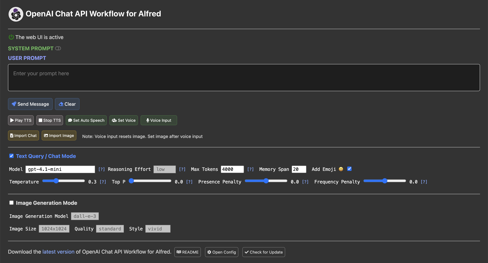</kbd>

**Simple Direct Query/Chat**

To quickly chat with GPT:

- Method 1: Type keyword `gpt` → space/tab → input query (e.g., "**gpt** what is a large language model?")
- Method 2: Set up a custom hotkey to `OpenAI Direct Query`

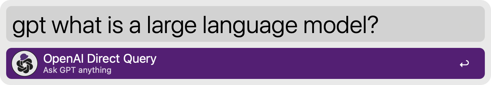
 
## Basic Commands

With `Direct Query`, the input text is sent directly to the OpenAI Chat API as a prompt. You can also create a query by prepending or appending text to the input.

 **Direct Query**

The input text is directly sent as a prompt to the OpenAI Chat API.

<kbd></kbd>

 **Prepend Text + Query**

After entering the initial text, you are prompted for additional text. The additional text is added *before* the initial text, and the resulting text is used as the query.

<kbd>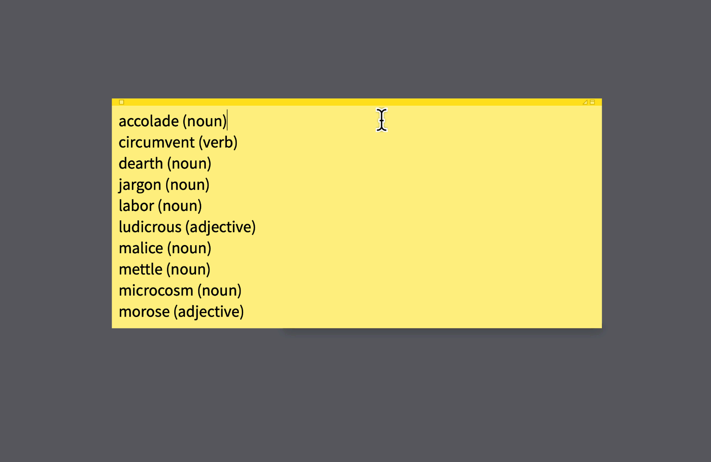</kbd>

 **Append Text + Query**

After entering the initial text, you are prompted for additional text. The additional text is added *after* the initial text, and the resulting text is used as the query.

 **Generate Image**

The GPT Image API (`gpt-image-2.5-flare` by default) is used to generate images based on the entered prompts. See [Image Generation](#image-generation) below.

## Image Generation

Image generation can be executed through one of the above commands. It is also possible to use the web UI. By using the web UI, you can interactively change the prompt to get closer to the desired image.

<kbd>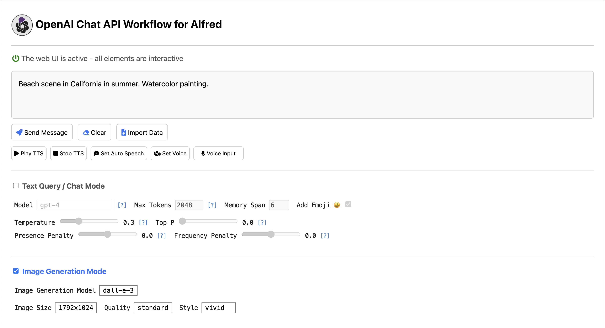</kbd>

To use the GPT Image models, you may need to complete the <a href="https://help.openai.com/en/articles/10910291-api-organization-verification">API Organization Verification</a> from your <a href="https://platform.openai.com/settings/organization/general">developer console</a>.

<kbd>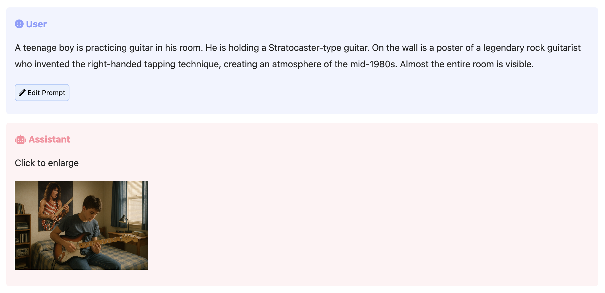</kbd>

<kbd></kbd>

## Image Editing

There is a command to edit images using the selected GPT Image model. There is a Universal Action command `OpenAI Image Edit`. You can also use the web UI to upload an image file for editing. The image file is sent to the OpenAI Image Editing API, and the result is displayed when it is ready. Processing time depends on the model, the quality and the request; `xhigh` and `max` can take over a minute. You can also start an edit from a screen capture with the keyword `openai-capture-edit`.

### Iterative Image Refinement

After an image is generated, a **Refine Image** panel appears below the result. You can type follow-up prompts to iteratively refine the image (e.g., "make the background blue", "zoom out"). The previously generated image is automatically used as the source for the next edit. The full conversation history (all prompts and images) is preserved on screen. Use **Cmd+Enter** or **Ctrl+Enter** to submit.

<kbd>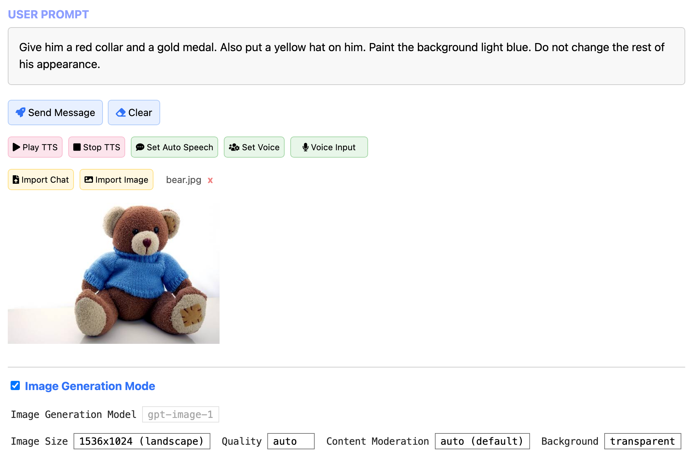</kbd>
<kbd></kbd>

## File Understanding

You can upload various file types for analysis through the web UI. Supported file types include:

- **Images**: PNG, JPG, JPEG, GIF, WebP
- **Documents**: PDF, Word (.doc, .docx), ODT, RTF
- **Spreadsheets**: Excel (.xls, .xlsx), CSV, TSV
- **Presentations**: PowerPoint (.ppt, .pptx)
- **Text & Code**: .txt, .md, .json, .html, .xml, .py, .rb, .js, .ts, .java, .c, .cpp, .go, .rs, .swift, .sql, and many more

Maximum file size is 50MB per file. Files are uploaded via OpenAI's Files API for processing, and the workflow asks OpenAI to delete each one after the response. If that request fails, for example when the network drops, the file may remain in your OpenAI storage.

Screen capture analysis can be executed through the `openai-vision` command, which starts capture mode and lets you specify a part of the screen to be analyzed. You can also send any supported file to OpenAI using the "OpenAI File Input" universal action in Finder.

<kbd>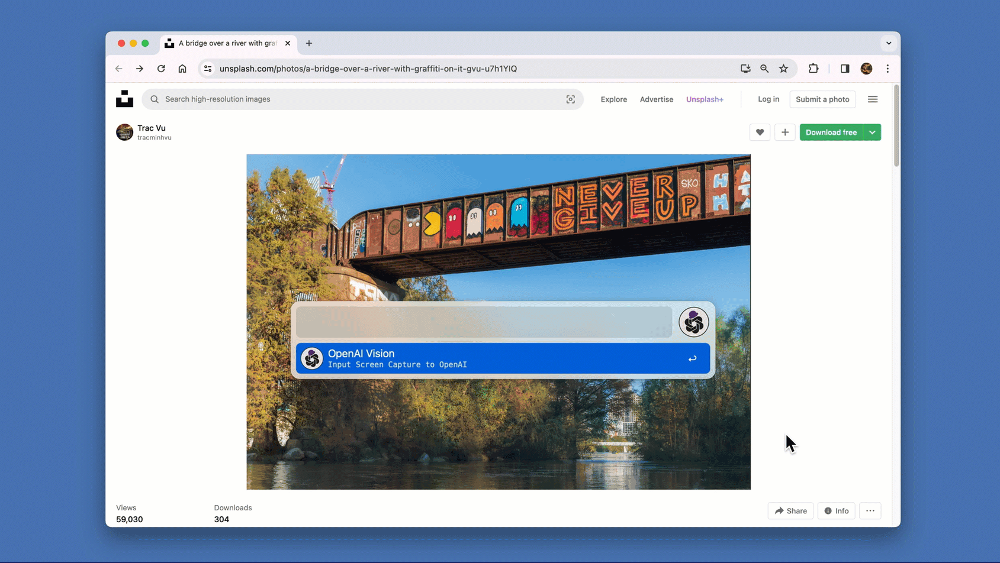</kbd>

Alternatively, you can use the web UI to upload a file for analysis. The file is sent to the OpenAI API, and the result is displayed in the web UI.

<kbd>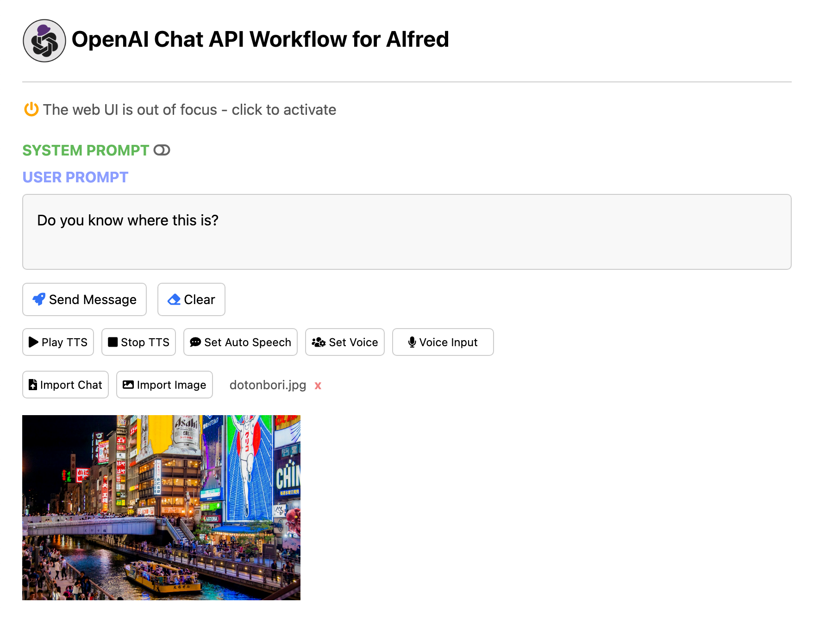</kbd>

You can also specify a file using the universal action hotkey on the file in Finder.

## Speech Synthesis and Speech Recognition

Most text-to-speech and speech-to-text features are available on the web UI. Some features are also available as commands, such as converting an audio file to text. Transcripts are plain text; timestamped subtitles are not available.

<kbd>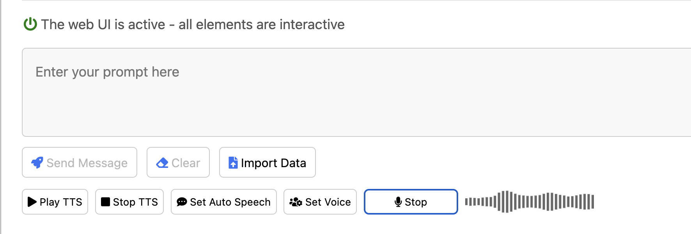</kbd>

**Text-to-Speech Synthesis**

Text entered or response text from GPT can be read out in a natural voice using OpenAI's text-to-speech API.

- Method 1: Press the `Play TTS` button on the web UI
- Method 2: Select text → universal action hotkey → select `OpenAI Text-to-Speech`
- Method 3: Alfred textbox → keyword (`openai-tts`) → space/tab → text to read aloud

**Speech-to-Text Conversion**

- Method 1: Press the `Voice Input` button on the web UI
- Method 2: Alfred textbox → keyword (`openai-speech`) (terminal recorder; requires SoX)

**Audio File to Text**

You can select an audio file in `mp3`, `mp4`, `flac`, `webm`, `wav`, or `m4a` format (under 25MB) and send it to the workflow:

- Select the file → universal action hotkey → select `OpenAI Speech-to-Text`

**Record Voice Audio and Transcribe**

You can record voice audio and send it to the Workflow for transcription using the speech-to-text API.

- **Web UI (Recommended)**: Press the `Voice Input` button on the web UI. The recording is made in the browser and transcribed through the API. No additional tools are required.
- **Alfred keyword**: Alfred textbox → keyword (`openai-speech`) starts a recorder in Terminal, which requires SoX (`rec`). If SoX is not installed, use Voice Input in the web UI.

The transcript is returned as plain text:

<kbd>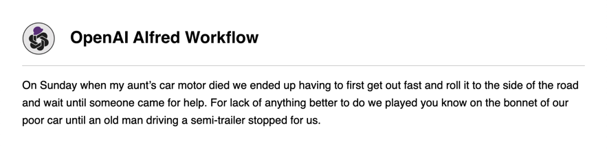</kbd>

## Other Features

**Import/Export**

You can save a conversation to a JSON file and continue it later by importing it again. On the chat screen, use `Export Data` and `Import Data`; on the starter screen, use `Import Chat`. The export holds the text of the conversation; attached files and generated images are not included, so keep the originals if you need them. Importing replaces the current chat.

**Monitor API Usage**

Type the keyword `openai-usage` to open OpenAI's [usage page](https://platform.openai.com/usage).

## Configuration Parameters

You can set various parameters in the settings panel of this Workflow. Some of them are used as defaults that you can change temporarily on the web UI. The web UI's `Open Config` button, or the keyword `openai-config`, opens the settings panel.

**Required Settings**

- **OpenAI API Key**: Your secret API key for OpenAI. Get one at [https://platform.openai.com/account/api-keys](https://platform.openai.com/account/api-keys). Alfred stores this setting in the workflow's folder, which is synced if you sync your Alfred preferences. To keep the key itself out of that folder, enter a reference instead:
  - `op://Vault/Item/field`: read from 1Password each time it is needed, with the [1Password CLI](https://developer.1password.com/docs/cli/) (`op read`). The CLI must be installed and signed in; turning on its integration with the 1Password app lets you approve with Touch ID.
  - `keychain:<name>`: read from the macOS keychain, from a generic password whose service is `<name>`. Add it with `security add-generic-password -s <name> -a openai -w` (you are prompted for the key). Useful if you run the workflow often and want to avoid 1Password prompts.

  The key read through a reference is used for the request and not stored anywhere. If it cannot be read (the CLI is missing or signed out, or the item does not exist), the result explains why. Entering the key itself keeps working as before.
- **Base URL**: The base URL of the OpenAI API. Change it only if you use a different endpoint. Chat, image, transcription and translation requests use it; text-to-speech always goes to OpenAI. (default: `https://api.openai.com/v1`)

**Web UI Parameters**

- **Loopback Address**: Either `localhost` or `127.0.0.1` is used as the address of the local server behind the web UI. If the web UI does not work as expected, try the other. The server accepts connections from this Mac only. (default: `127.0.0.1`)
- **Stream Output**: Show text results in the web browser as they are generated. If disabled, text results are shown with Alfred's Large Type. (default: `enabled`)
- **Hide Speech Buttons**: Hide the text-to-speech playback and voice input buttons on the web UI. (default: `disabled`)
- **Web UI Mode**: `light`, `dark`, or `auto`. (default: `auto`)

**Chat Parameters**

- **Model**: The chat model (default: `gpt-6-luna`). Available models: `gpt-6.1-sol`, `gpt-6-astra`, `gpt-6-sol`, `gpt-6-luna`, `gpt-5.6-sol`, `gpt-5.6-terra`, `gpt-5.6-luna`, `gpt-5.5`, `gpt-5.4`, `gpt-5.4-mini`, `gpt-5.4-nano`, and `gpt-5.3-codex`. See the model selection policy under Reasoning Effort below.
- **Reasoning Effort**: For reasoning models, set the reasoning effort to control how many reasoning tokens the model generates before creating a response. Available values and defaults vary by model:
  - **gpt-6.1-sol**: `low`, `medium`, `high`, `xhigh`, `max` (default: `low`)
  - **gpt-6-astra**: `low`, `medium`, `high`, `xhigh`, `max` (default: `low`)
  - **gpt-6-sol**: `none`, `low`, `medium`, `high`, `xhigh`, `max` (default: `none`)
  - **gpt-6-luna**: `none`, `low`, `medium`, `high`, `xhigh`, `max` (default: `none`)
  - **gpt-5.6-sol**: `none`, `low`, `medium`, `high`, `xhigh`, `max` (default: `none`)
  - **gpt-5.6-terra**: `none`, `low`, `medium`, `high`, `xhigh`, `max` (default: `none`)
  - **gpt-5.6-luna**: `none`, `low`, `medium`, `high`, `xhigh`, `max` (default: `none`)
  - **gpt-5.5**: `none`, `low`, `medium`, `high`, `xhigh` (default: `none`)
  - **gpt-5.4**: `none`, `low`, `medium`, `high`, `xhigh` (default: `none`)
  - **gpt-5.4-mini**: `none`, `low`, `medium`, `high`, `xhigh` (default: `none`)
  - **gpt-5.4-nano**: `none`, `low`, `medium`, `high`, `xhigh` (default: `none`)
  - **gpt-5.3-codex**: `none`, `low`, `medium`, `high`, `xhigh` (default: `none`)

  The `none` setting provides lower-latency interactions similar to non-reasoning models. `xhigh`, and `max` where the model accepts it, allow more reasoning for complex tasks, usually with a much longer wait. The web UI automatically adjusts available options based on the selected model.

  **Note**: When using Alfred's Configuration Builder (not the Web UI), all reasoning effort options are shown regardless of the selected model. If an invalid combination is selected (e.g., `max` with `gpt-5.4-mini`), the workflow automatically falls back to the model's default reasoning effort at runtime.

  **Model selection policy**: This workflow targets quick-turnaround Alfred interactions. Flagship `pro` variants (e.g., `gpt-5.5-pro`) and the `o`-series reasoning models are intentionally **not** bundled. Other models are included regardless of price. The default model is `gpt-6-luna` ($0.10 / $0.50 per 1M tokens), which keeps common usage inexpensive; you can switch to `gpt-6-sol` or `gpt-6.1-sol` (both $2 / $10) or `gpt-6-astra` for harder tasks. `gpt-6-astra` is the most capable model available and is priced accordingly ($10.00 / $50.00 per 1M tokens); it and `gpt-6.1-sol` do not accept `none` reasoning effort, so selecting either uses `low` instead. Prices shown are for prompts up to 272K tokens; longer prompts are billed at higher rates. The `gpt-5.6` and older models remain available, and a model already selected in your settings is kept after updating.

  See OpenAI's [documentation](https://platform.openai.com/docs/guides/reasoning#reasoning-effort).
- **Max Tokens**: Maximum number of tokens to generate (default: `4000`). Not used by the bundled models: they are all reasoning models, for which the limit would also count the model's reasoning and could leave the answer empty, so the workflow does not send it and the field is disabled. The value has no effect while only reasoning models are bundled.
- **Memory Span**: The number of most recent messages sent to the API as context, counting your new one. The system content is always sent in addition. The larger the value, the more tokens are consumed. (default: `20`, range `2`–`100`)
- **Max Characters**: Maximum number of characters that can be included in a query (default: `100000`).
- **Timeout (sec)**: How many seconds to wait for a reply on a non-streaming request (default: `240`). Streaming is enabled by default and ignores this: it uses a separate 720-second read timeout, and the web UI starts a 12-minute timer when a request is sent, which is cleared when the response finishes. Opening the connection has its own fixed timeout. Raise it if you turn streaming off and use a reasoning model at high effort, which can think for minutes before answering.
- **Add Emoji to Response**: If enabled, the workflow asks the model to include relevant emoji by adding the following sentence to the end of the system content. (default: `enabled`)
  
  > Add emojis that are appropriate to the content of the response.
  
- **System Content**: Text to send with every query sent to the API as general information about the specification of the chat. The default value is as follows:
  
  > You are a friendly but professional consultant who answers various questions, make decent suggestions, and give helpful advice in response to a prompt from the user. Your response must be concise, suggestive, and accurate. Ensure to tailor your advice to the user's specific needs, leveraging your expertise to guide them towards the best possible outcomes. Remember to add a touch of personalization to make each interaction memorable and engaging.

**Image Generation/Editing Parameters**

Image generation and editing are available for all three GPT Image models.

- **Image Generation Model**: `gpt-image-2.5-flare`, `gpt-image-2.5-sunburst`, or `gpt-image-2` (default: `gpt-image-2.5-flare`). Flare is the fastest for everyday images; Sunburst is the most capable, especially for precise edits. Both are billed at the same token rates as `gpt-image-2`.
- **Image Size for GPT Image**: Set the size of images to generate: `auto`, `1024x1024`, `1536x1024`, or `1024x1536` (default: `auto`)
- **Image Quality for GPT Image**: `auto`, `low`, `medium`, `high`, and, for the Image 2.5 models only, `xhigh` and `max` (default: `auto`). `xhigh` and `max` use more output tokens and can take over a minute. With `gpt-image-2`, they fall back to `auto`.
- **Moderation for GPT Image**: `auto` or `low` (default: `auto`)
- **Background for GPT Image**: `auto`, `transparent`, or `opaque` (default: `auto`)

**Speech-to-Text Parameters**

- **Transcription Model**: `gpt-transcribe`. The transcript is plain text. (`whisper-1`, `gpt-4o-transcribe` and `gpt-4o-mini-transcribe`, which OpenAI is shutting down, were removed in 5.7.0, and with them the `srt` and `vtt` output formats, which no remaining model provides.)
- **Processes after Recording**: The default action for the terminal recorder started by `openai-speech` when recording finishes. It does not affect Voice Input in the web UI. (default: `Transcribe [+ delete recording]`)
  
  - Transcribe [+ delete recording]
  - Transcribe [+ save recording to desktop]
  - Transcribe and query [+ delete recording]
  - Transcribe and query [+ save recording to desktop]
  
- **Audio to English**: When enabled, the audio is transcribed and the transcript is then translated into English with `gpt-5.6-terra`. This adds an additional text-model request. A transcript over 16,000 bytes (about 5,000 Japanese characters) is not translated. If translation fails, the audio is kept, and the workflow tries to save the transcript in the cache and reports where it is or that it could not be saved. (default: `disabled`)

**Text-to-Speech Parameters**

- **Text-to-Speech Model**: One of the available TTS models: `tts-1`, `tts-1-hd`, or `gpt-4o-mini-tts`. (default: `gpt-4o-mini-tts`)
- **Text-to-Speech Voice**: The voice to use when generating the audio. Supported voices are: `alloy`, `ash`, `ballad`, `coral`, `echo`, `fable`, `onyx`, `nova`, `sage`, and `shimmer`. (default: `alloy`)
- **Text-to-Speech Speed**: The speed of the generated audio. Select a value from 0.25 to 4.0. (default: `1.0`)
- **TTS Instructions**: Specify character or speaking style instructions for text-to-speech synthesis. Used by `gpt-4o-mini-tts` only; `tts-1` and `tts-1-hd` ignore them.
- **Automatic Text to Speech**: If enabled, responses are read aloud using OpenAI's text-to-speech API with the configured model and voice. Each reading is an additional API request. (default: `disabled`)

**Other Settings**
- **Sound**: If checked, a notification sound plays when a response or an error is returned, and for some text-to-speech actions. (default: `disabled`)
- **Debug Mode**: If enabled, errors include debug details. (default: `disabled`)
- **Save Folder**: If set, text results are saved here as Markdown files and generated images are copied here. If not set, results stay only in the workflow's cache, where files older than 7 days are removed the next time the local server starts (the current conversation is kept; generated images are kept only until you start a new session; see Troubleshooting). The folder must already exist. A folder inside the workflow folder or the cache is refused: no copy is written there, and a notification says why. (default: `not set`)

**Environment Variables**

Environment variables can be accessed by clicking the `[x]` button located at the top right of the workflow settings screen. Normally, there is no need to change the values of the environment variables.

- `http_keep_alive`: This workflow starts an HTTP server when the web UI is first displayed. After that, if the web UI is not used for the time (in seconds) set by this environment variable, the server will stop. (default: `7200` = 2 hours)
- `http_port`: Specifies the port number for the web UI. (default: `8787`)
  - Note: Default changed to 8787 in v4.0.0 to avoid privileged port conflicts.
- `http_server_wait`: Specifies the wait time from when the HTTP server is started until the page is displayed in the browser. (default: `2.5`)
- `websocket_port`: Specifies the port number for websocket communication used to display responses in streaming on the web UI. (default: `8080`)

## Troubleshooting

- Port conflict or permission error
  - The web UI binds to `127.0.0.1` on `http_port` (default `8787`). If startup fails with a port error, change the environment variable `http_port` to a free non‑privileged port (e.g., `8888`).
- Logs location and rotation
  - Logs are written to `$alfred_workflow_cache/workflow.log` with simple rotation (up to ~1MB × 5 files).
- macOS notification permission
  - If startup error notifications do not appear, check System Settings → Notifications → allow notifications for Alfred.
- Cache management
  - Uploaded files, TTS audio, generated images, and temporary HTML are cached in `$alfred_workflow_cache`. Old files (7+ days) are automatically cleaned up when the server starts.
  - The **Clear Cache** button on the web UI (starter page or chat page) clears them on demand. It removes uploaded files, TTS audio, page templates, and images that are no longer shown.
  - The current text conversation is kept, with the images attached to it. Generated images are kept only while their image session lasts: starting a new session (`Start New Chat`, or opening the web UI again, which is how you get back to the Clear Cache button) ends it, after which Clear Cache and the 7-day cleanup remove them. To keep images, use the Save folder setting or download them.
- External tools
  - None are needed, except SoX (`rec`) for the terminal recorder started by `openai-speech`. Voice input in the web UI needs nothing extra.

## Author

Yoichiro Hasebe (<yohasebe@gmail.com>)

## License

The MIT License

## Disclaimer

The author assumes no responsibility for any potential damages arising from the use of this software.
