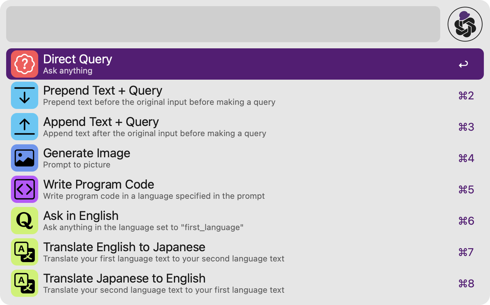
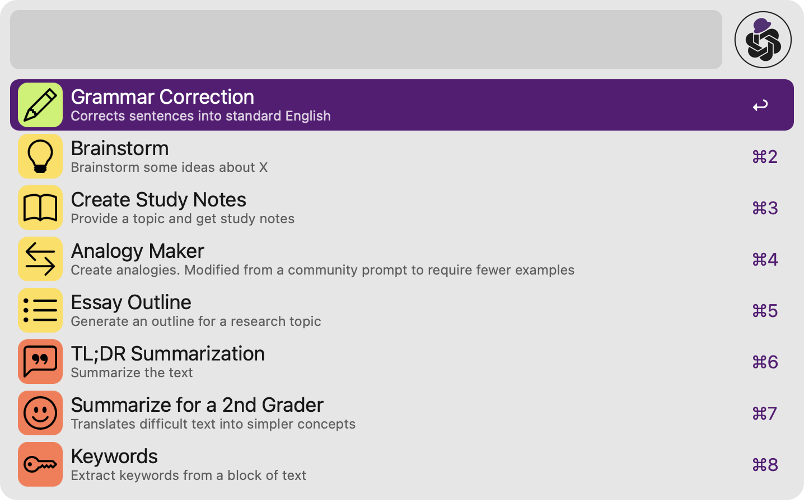

# OpenAI Text-Completion Workflow for Alfred


[Alfred 5](https://www.alfredapp.com/) Workflow for using [OpenAI](https://beta.openai.com/) GPT-3.5 and GPT-4 with Text Completion/Chat API.

It also allows image generation using the DALL-E API and speech-to-text conversion using the Whisper API (from microphone input or existing audio files)





## Downloads

**Current version**: **1.11.0**

[**Download Workflow**](https://github.com/yohasebe/openai-text-completion-workflow/raw/main/openai-text-completion-workflow.alfredworkflow)

**Change Log**

- 1.11.0: Speech-to-text using Whisper API added
- 1.10.2: `Enhance Prompt` supports both `gpt-4` and `gpt-3.5-turbo`.
- 1.10.0: `Enhance Prompt` option for image generation mode added
- 1.9.1: 1024x1024 image generation issue fixed
- 1.9.0: Image generation using DALL·E API supported
- 1.8.2: New models (`gpt-3.5-turbo-0613`, `gpt-3.5-turbo-16k-0613`, `gpt-4-0613`) supported
- 1.8.1: Added option to change base URL of the OpenAI API
- 1.8.0: Custom CSS feature added
- 1.7.0: Improved UI
- 1.6.9: GPT-4 models (e.g., `gpt-4`) supported
- 1.6.7: Fixed an error that occurred for some users
- 1.6.6: Debug mode added that outputs error messages when problems occur
- 1.6.5: Automatic detection of Pandoc installation
- 1.6.4: Supress "Please Wait" message feature
- 1.6.3: OpenAI Textbox feature updated
- 1.6.0: `GPT-3.5-turbo` model is set to the default
- 1.6.0: ChatGPT API support
- 1.6.0: HTML output option (using Pandoc) is enabled by default
- 1.6.0: check-for-update command removed (in preparation for Alfred Gallery inclusion)

[Complete Change Log](https://github.com/yohasebe/openai-text-completion-workflow/blob/main/CHANGELOG.md)

## Dependencies

- Alfred 5 [Powerpack](https://www.alfredapp.com/shop/)
- OpenAI [API key](https://platform.openai.com/account/api-keys)
- [Pandoc](https://pandoc.org/): See below for installation instructions
- [Sox](https://sox.sourceforge.net/sox.html): See below for installation instructions

To start using this workflow, you must set the environment variable `apikey`, which you can get by creating a new [OpenAI account](https://platform.openai.com/account/api-keys). See also the [Configuration](#configuration) section below.

You will also need to install the `pandoc` and `sox` programs. Pandoc will allow this workflow to convert the Markdown response from OpenAI to HTML and display the result in your default web browser with syntax highlighting enabled (especially useful when using this workflow to generate program code). Sox will allow you to record voice audio to convert to text using Whisper speech-to-text API.

Installing Pandoc and Sox will be just a few clicks once this workflow has been included in the [Alfred Gallery](https://alfred.app/). For now, install these programs using [homebrew](https://brew.sh/). Once homebrew is installed, run the following command.

```shell
  brew install pandoc sox
```

## How to Execute This Workflow

### 📋 Using Selected Text

You can select any text on your Mac and send it to the workflow:

- Method 1: select text → universal action hotkey → select `OpenAI Query`
- Method 2: set up a custom hotkey to `Send selected text to OpenAI`

### ⌨️ Using Alfred Textbox

You can enter a query text directly into Alfred textbox:

- Method 1: Alfred textbox → keyword (`openai`) → tab → input query text
- Method 2: Alfred textbox → input query text → select fallback search (`OpenAI Query`)

### 🌐 Using Text Box in Default Web-browser

You can open a web interface (see the figure below).

- Method 1: Alfred textbox → keyword (`openai-textbox`)
- Method 2: set up a custom hotkey to `Open web interface`


## General Query

The input text is used as a prompt to the OpenAI text-completion API. The original input text can be prepended or postfixed with instructional text to compose a complex query to be given to the API.

#### <span></span> Direct Query

The input text is directly sent as a prompt to the OpenAI text-completion API.


#### <span></span> Prepend Text + Query

After the initial text is entered, the user is prompted for additional text. The additional text is added *before* the initial text, and the resulting text is used as the query.


#### <span></span> Append Text + Query

After the initial text is entered, the user is prompted for additional text. The additional text is added *after* the initial text and the resulting text is used as the query.

#### <span></span> Generate Image

The DALL-E API is used to generate images according to the prompts entered. In general, the more detailed the prompt, the closer the content and quality of the output image will be to what is desired. 

> Rugby players are playing in a match using a huge watermelon as a ball

<kbd></kbd>

When the `Enhance Prompt` option is enabled, a short prompt, for example the following, is expanded by GPT into more detailed text, which is then used to generate images.

> View of downtown Austin from across the river

<kbd></kbd>

#### <span></span> Write Program Code

GPT will generate program code and example output according to the text entered. Specify the purpose of the program, its function, the language and technology to be used, etc.

**Example Input**

> Create a command line program that takes an English sentence and returns syntactically parsed output. Provide program code in Python and example usage.

**Example Output**

<kbd></kbd>

## More Specific Commands

These are features mainly based on OpenAI's example usage of its text-completion API. The user-specified values to the following user settings are ignored when running these commands:

- `temperature`
- `frequency_penalty`
- `presence_penalty`

### Language-related

#### <span></span> Ask in Your Language 

You can ask questions in the language set to the variable `first_language`. 

**Note**: If the value of `first_language` is not `English` (e.g. `Japanese`), the query may result in a more or less inaccurate response.

#### <span></span> Translate L1 to L2 

Translate text in the language specified in the variable `first_language` to the language specified in the `second_language`.

#### <span></span> Translate L2 to L1 

Translate text in the language specified in the variable `second_language` to the language specified in the variable `first_language`.

#### <span></span> Grammar Correction

Correct sentences into standard English. See OpenAI's [description](https://beta.openai.com/examples/default-grammar).

### Idea-related

#### <span></span> Brainstorm

Brainstorm some ideas about a given text.

#### <span></span> Create Study Notes

Provide a topic and get study notes. See OpenAI's [description](https://beta.openai.com/examples/default-study-notes) for this example.

#### <span></span> Analogy Maker 

Create analogies. See OpenAI's [description](https://beta.openai.com/examples/default-analogy-maker) for this example.

#### <span></span> Essay Outline 

Generate an outline for a research topic. See OpenAI's [description](https://beta.openai.com/examples/default-essay-outline) for this example.

### Summarization-related

#### <span></span> TL;DR Summarization 

Summarize text by adding a 'tl;dr:' to the end of a text passage. See OpenAI's [description](https://beta.openai.com/examples/default-tldr-summary) for this example.

#### <span></span> Summarize for a 2nd Grader 

Translates complex text into more straightforward concepts. See OpenAI's [description](https://beta.openai.com/examples/default-summarize) for this example.

#### <span></span> Keywords

Extract keywords from a block of text. See OpenAI's [description](https://beta.openai.com/examples/default-keywords) for this example.

## Speech to Text

The Whisper API can convert speech into text in a variety of languages. Please refer to the [Whisper API FAQ](https://help.openai.com/en/articles/7031512-whisper-api-faq) for available languages and other limitations.

### Audio File to Text

You can select an audio file in `mp3`, `mp4`, `flac`, `webm`, `wav`, or `m4a` format (under 25MB) and send it to the workflow:

Select the file → universal actioin hotkey select → `OpenAI Speech-to-Text`

### Record Voice Audio and Transcribe

Alternatively you can record voice audio and send it to the Workflow for transcription using the Whisper API. The recording must be no longer than 30 minutes and will automatically stop after this time. Recording time is limited to 30 minutes and stops automatically after this limit.

<kbd></kbd>

- Alfred textbox → keyword (`openai-speech`) → Terminal window opens and recording starts
- Speak to internal or external microphone → Press Enter to finish recording
- Choose processes to apply to the recorded audio

  - transcribe (+ delete recording)
  - transcribe (+ save recording to desktop)
  - transcribe and query (+ delete recording)
  - transcribe and query (+ save recording to desktop)
  - exit (+ delete recording)
  - exit (+ save recording to desktop)

You can choose the format of the transribed text from `text`, `srt` or `vtt` in the workflow's settings. Below are examples in the `text` and `srt` formats:

<kbd></kbd>

<kbd></kbd>

## Check API Usage

You can check how many tokens you have used in the current billing period on OpenAI Usage Page--type in the keyword `openai-usage`. See also OpenAI's [Billing](https://platform.openai.com/account/billing/overview) page.

## Configuration 

### Required Settings

- **OpenAI API Key**: Set your secret API key for OpenAI. Sign up for OpenAI and get your API key at [https://platform.openai.com/account/api-keys/](https://platform.openai.com/account/api-keys).
- **Model**: OpenAI's chat/completion [model](https://beta.openai.com/docs/api-reference/models) that generates the completion. (default: `gpt-3.5-turbo`)
- **Base URL**: The base URL of the OpenAI chat/completion API. (default: `https://api.openai.com/v1`)

### Text Query Parameters

- **Max Tokens**: See OpenAI's [documentation](https://beta.openai.com/docs/api-reference/completions/create#completions/create-max_tokens). (default: `2048`)
- **Temperature**: See OpenAI's [documentation](https://beta.openai.com/docs/api-reference/completions/create#completions/create-temperature). (default: `0.3`)
- **Top P**: See OpenAI's [documentation](https://beta.openai.com/docs/api-reference/completions/create#completions/create-top_p). (default: `1.0`)
- **Frequency Penalty**: See OpenAI's [documentation](https://beta.openai.com/docs/api-reference/completions/create#completions/create-frequency_penalty). (default: `0.0`)
- **Presence Penalty**: See OpenAI's [documentation](https://beta.openai.com/docs/api-reference/completions/create#completions/create-presence_penalty). (default: `0.0`)

### Image Generation Parameters

- **Number of Images**: Set the number of images to generate in image generation mode from `1` to `10`. (default: `1`)
- **Image Size**: Set the size of images to generate from `256x256`, `512x512`, `1024x1024`. (default: ` 512x512`)
- **Enhance Prompt**: When enabled, the prompt to the image generation API is automatically enhanced using a GPT-4 model specified in the configuration. This variable is only enabled when the `model` is set to one of the "gpt-4" series. 

### Speech-to-Text Parameters

- **Transcription Format**: Set the format of the text transcribed from the microphone input or audio files from `text`, `srt`, or `vtt`. (default: `text`)
- **Processes after Recording** Set the default choice of what processes follow after audio recording finishes (default: `transcribe [recording will be deleted]`).
 
  - Transcribe [+ delete recording]
  - Transcribe [+ save recording to desktop]
  - Transcribe and query [+ delete recording]
  - Transcribe and query [+ save recording desktop]

- **Audio to English**: When enabled, Whisper API will transcribe the input audio and output text translated into English. (default: `disabled`)

### Optional Settings

- **Your First Language**: Set your first language. This language is used when using GPT for translation. (default: `English`)
- **Your Second Language**: Set your second language. This language is used when using GPT for translation.(default: `Japanese`)
- **Max Characters**: Maximum number of characters that can be included in a query (default: `10000`).
- **Timeout**: Number of seconds before the timeout (default: `180`).
- **"Please Wait" Message**: If disabled, the "Please Wait" message is suppressed. (default: `enabled`)
- **Sound**: If checked, a notification sound will play when the response is returned. (default: `disabled`)
- **Echo**: If enabled, the original prompt is contained in the result text. (default: `enabled`)
- **Save File Path**: If set, the results will be saved in the specified path as a markdown file. (default: `not set`)
- **Text to Speech**: If enabled, the results will be read aloud using the system's default text-to-speech language and voice. (default: `disabled`)
- **Output HTML Using Pandoc**: Show results in the default web browser if pandoc is installed. If unchecked (or Pandoc is not installed), Alfred's "Large Type" feature is used to display the result. (default: `enabled`)
- **Custom CSS**: You can specify CSS for the query results HTML. (default: `not set`)

#### Text to Speech

If the `Text to Speech` option is enabled, the result text will be read aloud in the system's standard language and voice. To change the language and speech, go to [Accessibility] - [Vision] -[Spoken Content] in the Mac Settings panel.

<kbd></kbd>

#### Custom CSS

You can define the CSS for the HTML that will be displayed as a result of the query. For example, you can freely change the maximum text width, font size and type, background color, etc.

<kbd></kbd>

## Author

Yoichiro Hasebe (<yohasebe@gmail.com>)

## License

The MIT License

## Disclaimer

The author of this software takes no responsibility for any damage that may result from using it. 
