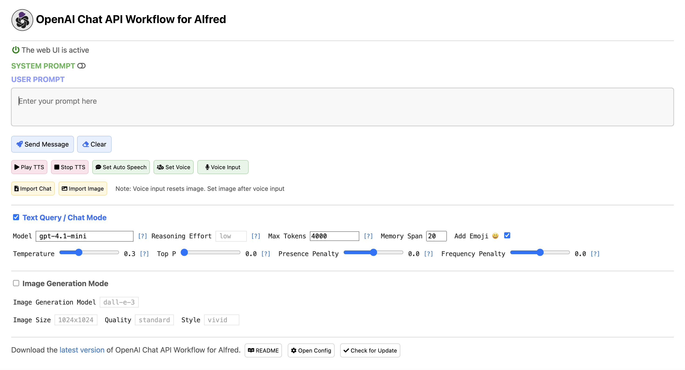
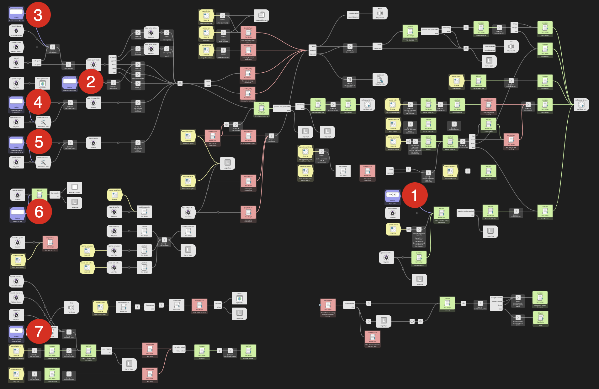
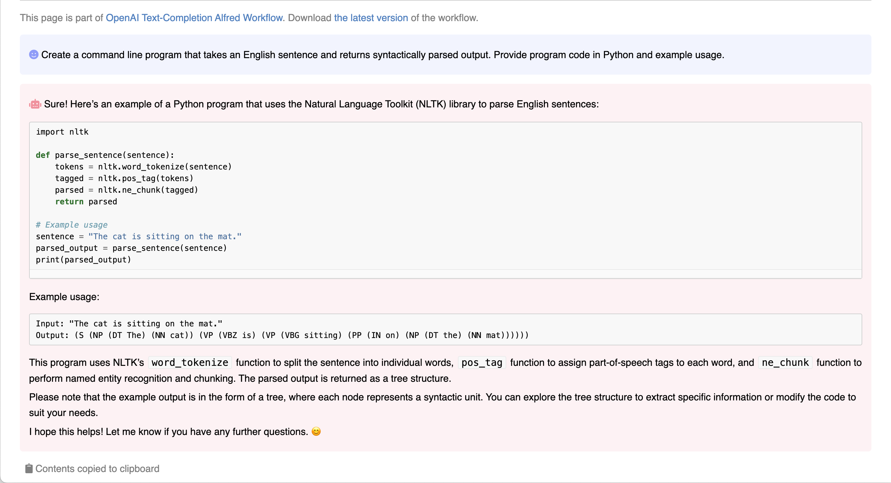

# OpenAI Chat API Workflow for Alfred


🎩 An [Alfred 5](https://www.alfredapp.com/) Workflow for using the [OpenAI](https://platform.openai.com/) Chat API to interact with GPT models 🤖💬. It also allows image generation 🖼️, image understanding 👀, speech-to-text conversion 🎤, and text-to-speech synthesis 🔈.

📦 Download [**OpenAI Chat API Workflow**](https://github.com/yohasebe/openai-chat-api-workflow/raw/main/openai-chat-api.alfredworkflow) (version `4.4.0`)

You can execute all the above features using:

- Alfred UI 🖥️
- Selected text 📝
- A dedicated web UI 🌐

The web UI is constructed by the workflow and runs locally on your Mac 💻. The API call is made directly between the workflow and OpenAI, ensuring your chat messages are not shared online with anyone other than OpenAI 🔒. Furthermore, OpenAI does not use the data from the API Platform for training 🚫.

You can export the chat data to an external file in simple JSON format 📄, and it is possible to continue the chat by importing it later 🔄.


<kbd></kbd>

<kbd></kbd>

## Installation

1. Install [Homebrew](https://brew.sh/)
2. Run the following command in a terminal: `brew install pandoc mpv sox jq duti`
3. Download and run [**OpenAI Chat API Workflow**](https://github.com/yohasebe/openai-chat-api-workflow/raw/main/openai-chat-api.alfredworkflow)
4. Set your [OpenAI API key](https://platform.openai.com/account/api-keys)
5. Enable accessibility settings for Alfred in `System Preferences` → `Security & Privacy` → `Privacy` → `Accessibility`

<kbd></kbd>

**Setup Hotkeys**

You can set up hotkeys in the settings screen of the workflow. To set up hotkeys, double-click on the light purple workflow elements.

<kbd></kbd>

1. Open Web UI (Recommended)
2. Direct Query
3. Send Selected Text
4. Screen Capture for Image Editing 
5. Screen Capture for Image Understanding
6. Speech to Text
7. Text to Speech (Selected text)

There is also a "Stop text-to-speech playback" command to stop the playback of the text-to-speech audio stream. Current it needs to be assigned a hotkey different from that of the "Text to Speech" command.

**Dependencies**

- Alfred 5 [Powerpack](https://www.alfredapp.com/shop/)
- OpenAI [API key](https://platform.openai.com/account/api-keys)
- [Pandoc](https://pandoc.org/): to convert Markdown to HTML
- [MPV](https://mpv.io/): to play text-to-speech audio stream
- [Sox](https://sox.sourceforge.net/sox.html): to record voice input
- [jq](https://jqlang.github.io/jq/): to handle chat history in JSON
- [duti](https://github.com/moretension/duti): to detect the default web browser

To start using this workflow, you must set the environment variable `apikey`, which you can obtain by creating a new [OpenAI account](https://platform.openai.com/account/api-keys). See also the [Configuration](#configuration) section below.

You will also need to install the `pandoc` and `sox` programs. Pandoc allows this workflow to convert the Markdown response from OpenAI to HTML and display the result in your default web browser with syntax highlighting enabled (especially useful when using this workflow to generate program code). Sox allows you to record voice audio to convert to text using the speech-to-text API.

To set up dependencies (`pandoc`, `mpv`, `sox`, `jq`, and `duti`), first install [Homebrew](https://brew.sh/) and run the following command:

```shell
brew install pandoc mpv sox jq duti
```

**Recent Changelog**

- 4.4.0:
  - New image generation model: `gpt-image-1.5` (now default)
  - Added `gpt-image-1-mini` for cost-effective image generation
  - `gpt-image-1.5` offers best-in-class image quality and instruction following
  - DALL·E 2 and DALL·E 3 still available but deprecated (support ends 05/12/2026)
- 4.3.0:
  - New TTS model: `gpt-4o-mini-tts-2025-12-15` (now default)
  - New STT model: `gpt-4o-mini-transcribe-2025-12-15` (now default)
  - Improved error rates, fewer hallucinations, better instruction following
  - Enhanced support for Chinese, Japanese, Indonesian, Hindi, Bengali, Italian
- 4.2.0:
  - GPT-5.2 series models now supported (`gpt-5.2`, `gpt-5.2-chat-latest`, `gpt-5.2-pro`)
  - New `xhigh` reasoning effort level for maximum quality
  - `gpt-5.2-pro` has very high API pricing - confirmation dialog added
  - Model-specific reasoning effort constraints for GPT-5.2 series
  - Web UI updated with new models and pricing warning
- 4.1.0:
  - GPT-5.1 series models now supported (`gpt-5.1`, `gpt-5.1-chat-latest`, `gpt-5.1-codex`, `gpt-5.1-codex-mini`)
  - `gpt-5.1` replaces `gpt-5` as the flagship model with enhanced reasoning capabilities
  - `gpt-5.1-chat-latest` replaces `chatgpt-4o-latest` for latest optimizations
  - New codex variants (`gpt-5.1-codex`, `gpt-5.1-codex-mini`) for code generation tasks
  - Model-specific reasoning effort constraints with dynamic UI adjustment
  - Removed older models: `gpt-5`, `gpt-4.1` series, `gpt-4o` series, `chatgpt-4o-latest`
  - Default model remains `gpt-5-mini` for balanced performance
  - `gpt-5-mini` and `gpt-5-nano` continue to be supported
- 4.0.0:
  - GPT-5 series models (`gpt-5`, `gpt-5-mini`, `gpt-5-nano`) supported with Responses API
  - GPT-5 models feature reasoning capabilities with configurable reasoning_effort (minimal/low/medium/high)
  - Note: Only `gpt-5` supports `minimal` reasoning_effort. `gpt-5-mini`, `gpt-5-nano`, and other reasoning-capable models do not support `minimal`.
  - Default model changed to `gpt-5-mini`
  - Removed support for o1, o3, o4 series reasoning models
  - GPT-4.1 and earlier models continue to use Chat Completion API
  - Full support for PDF and image understanding across all GPT-5 models

[Complete Change Log](https://github.com/yohasebe/openai-chat-api-workflow/blob/main/CHANGELOG.md)

## Methods of Execution

Here are three methods to run the workflow: 1) Using commands within the Alfred UI, 2) Passing selected text to the workflow, 3) Utilizing the Web UI. Additionally, there's a convenient method for making brief inquiries to GPT.

**Commands within the Alfred UI**

You can enter a query directly into Alfred's textbox:

- Method 1: Alfred textbox → keyword (`openai`) → space/tab → input query → select a command (see below)
- Method 2: Alfred textbox → input query → select fallback search (`OpenAI Query`)

**Passing Selected Text**

You can select any text on your Mac and send it to the workflow:

- Method 1: Select text → universal action hotkey → select `OpenAI Query`
- Method 2: Set up a custom hotkey to `Send selected text to OpenAI`

**Using Web Interface**

You can open the web interface:

- Method 1: Alfred textbox → keyword (`openai-webui`)
- Method 2: Set up a custom hotkey to `Open web interface`

**Using the Default Browser**

If your default browser is set to one of the following and the duti command is installed on your system, the web interface will automatically open in your chosen browser. If not, Safari will be used as the default.

- Google Chrome (Stable, Beta, Dev, etc.)
- Microsoft Edge (Stable, Beta, Dev, etc.)
- Brave Browser

Restart the OpenAI Workflow server by executing `openai-restart-server` if the web UI does not work as expected after changing the default browser.

**Web UI Modes**

Switch modes (`light`/`dark`/`auto`) with the `Web UI Mode` selector in the settings.

<kbd></kbd>

**Simple Direct Query/Chat**

To quickly chat with GPT:

- Method 1: Type keyword `gpt` → space/tab → input query (e.g., "**gpt** what is a large language model?")
- Method 2: Set up a custom hotkey to `OpenAI Direct Query`


 
## Basic Commands

With `Direct Query`, the input text is sent directly to the OpenAI Chat API as a prompt. You can also create a query by prepending or appending text to the input.

<span></span> **Direct Query**

The input text is directly sent as a prompt to the OpenAI Chat API.

<kbd></kbd>

<span></span> **Prepend Text + Query**

After entering the initial text, you are prompted for additional text. The additional text is added *before* the initial text, and the resulting text is used as the query.

<kbd></kbd>

<span></span> **Append Text + Query**

After entering the initial text, you are prompted for additional text. The additional text is added *after* the initial text, and the resulting text is used as the query.

<span></span> **Generate Image**

The GPT Image API (`gpt-image-1.5`, `gpt-image-1`, or `gpt-image-1-mini`) is used to generate images based on the entered prompts. See [Image Generation](#image-generation) below.

## Commands for Specific Purposes

Some of the examples shown on [OpenAI's Examples page](https://platform.openai.com/examples) are incorporated into this Workflow as commands. Functions not prepared as commands can be realized by giving appropriate prompts to the above [Basic Commands](#basic-commands).

<span></span> **Write Program Code**

GPT generates program code and example output based on the entered text. You can specify the purpose of the program, its function, the language, and the technology to be used, etc.

**Example Input**

> Create a command line program that takes an English sentence and returns syntactically parsed output. Provide program code in Python and example usage.

**Example Output**

<kbd></kbd>

<span></span> **Ask in Your Language**

You can ask questions in the language set to the variable `first_language`.

**Note**: If the value of `first_language` is not `English` (e.g., `Japanese`), the query may result in a less accurate response.

<span></span> **Translate L1 to L2**

GPT translates text from the language specified in the variable `first_language` to the language specified in `second_language`.

<span></span> **Translate L2 to L1**

GPT translates text from the language specified in the variable `second_language` to the language specified in `first_language`.

<span></span> **Grammar Correction**

GPT corrects sentences that may contain grammatical errors. See OpenAI's [examples](https://platform.openai.com/examples).

<span></span> **Brainstorm**

GPT assists you in brainstorming innovative ideas based on any given text.

<span></span> **Create Study Notes**

GPT provides study notes on a given topic. See OpenAI's [examples](https://platform.openai.com/examples).

<span></span> **Analogy Maker**

GPT creates analogies. See OpenAI's [examples](https://platform.openai.com/examples).

<span></span> **Essay Outline**

GPT generates an outline for a research topic. See OpenAI's [examples](https://platform.openai.com/examples).

<span></span> **TL;DR Summarization**

GPT summarizes a given text. See OpenAI's [examples](https://platform.openai.com/examples).

<span></span> **Summarize for a 2nd Grader**

GPT translates complex text into more straightforward concepts. See OpenAI's [examples](https://platform.openai.com/examples).

<span></span> **Keywords**

GPT extracts keywords from a block of text. See OpenAI's [examples](https://platform.openai.com/examples).

## Image Generation

Image generation can be executed through one of the above commands. It is also possible to use the web UI. By using the web UI, you can interactively change the prompt to get closer to the desired image.

<kbd></kbd>

To use the image generation mode with the `gpt-image-1` model, you may need to complete the <a href="https://help.openai.com/en/articles/10910291-api-organization-verification">API Organization Verification</a> from your <a href="https://platform.openai.com/settings/organization/general">developer console</a>.

<kbd></kbd>

<kbd></kbd>


## Image Editing

There is a command to edit images using the `gpt-image-1` model. There is an Universal Action command `OpenAI Image Edit`. You can also use the web UI to upload an image file for editing. The image file is sent to the OpenAI Image Editing API, and the result is displayed after a while (at the maximum of 2 minutes).

<kbd></kbd>
<kbd></kbd>

## Image/PDF Understanding

Image understanding can be executed through the `openai-vision` command. It starts capture mode and lets you specify a part of the screen to be analyzed. Alternatively, you can specify an image file (jpg, jpeg, png, gif) using the "OpenAI Vision" file action.

<kbd></kbd>

Alternatively, you can use the web UI to upload an image file for analysis. The image file is sent to the OpenAI Vision API, and the result is displayed in the web UI.

<kbd></kbd>

You can also specify an image file using the universal action hotkey on the file in Finder. With this method you can not only analyze image files (jpg, jpeg, png, gif) but also PDF files.

## Speech Synthesis and Speech Recognition

Most text-to-speech and speech-to-text features are available on the web UI. However, there are certain specific features provided as commands, such as audio file to text conversion and transcription with timestamps.

<kbd></kbd>

**Text-to-Speech Synthesis**

Text entered or response text from GPT can be read out in a natural voice using OpenAI's text-to-speech API.

- Method 1: Press the `Play TTS` button on the web UI
- Method 2: Select text → universal action hotkey → select `OpenAI Text-to-Speech`

**Speech-to-Text Conversion**

- Method 1: Press the `Voice Input` button on the web UI
- Method 2: Alfred textbox → keyword (`openai-speech`)

**Audio File to Text**

You can select an audio file in `mp3`, `mp4`, `flac`, `webm`, `wav`, or `m4a` format (under 25MB) and send it to the workflow:

- Select the file → universal action hotkey → select `OpenAI Speech-to-Text`

**Record Voice Audio and Transcribe**

You can record voice audio and send it to the Workflow for transcription using the speech-to-text API. Recording time is limited to 30 minutes and will automatically stop after this duration.

<kbd></kbd>

- Alfred textbox → keyword (`openai-speech`) → Terminal window opens and recording starts
- Speak into the internal or external microphone → Press Enter to finish recording
- Choose processes to apply to the recorded audio:

  - Transcribe (+ delete recording)
  - Transcribe (+ save recording to desktop)
  - Transcribe and query (+ delete recording)
  - Transcribe and query (+ save recording to desktop)
  - Exit (+ delete recording)
  - Exit (+ save recording to desktop)

You can choose the format of the transcribed text as `text`, `srt`, or `vtt` in the workflow's settings. Below are examples in the `text` and `srt` formats:

<kbd></kbd>

<kbd></kbd>

## Speech Synthesis and Speech Recognition

Most text-to-speech and speech-to-text features are available on the web UI. However, there are certain specific features provided as commands, such as audio file to text conversion and transcription with timestamps.

<kbd></kbd>

**Text-to-Speech Synthesis**

Text entered or response text from GPT can be read out in a natural voice using OpenAI's text-to-speech API.

- Method 1: Press the `Play TTS` button on the web UI
- Method 2: Select text → universal action hotkey → select `OpenAI Text-to-Speech`

**Speech-to-Text Conversion**

- Method 1: Press the `Voice Input` button on the web UI
- Method 2: Alfred textbox → keyword (`openai-speech`)

**Audio File to Text**

You can select an audio file in `mp3`, `mp4`, `flac`, `webm`, `wav`, or `m4a` format (under 25MB) and send it to the workflow:

- Select the file → universal action hotkey → select `OpenAI Speech-to-Text`

**Record Voice Audio and Transcribe**

You can record voice audio and send it to the Workflow for transcription using the speech-to-text API. Recording time is limited to 30 minutes and will automatically stop after this duration.

<kbd></kbd>

- Alfred textbox → keyword (`openai-speech`) → Terminal window opens and recording starts
- Speak into the internal or external microphone → Press Enter to finish recording
- Choose processes to apply to the recorded audio:

  - Transcribe (+ delete recording)
  - Transcribe (+ save recording to desktop)
  - Transcribe and query (+ delete recording)
  - Transcribe and query (+ save recording to desktop)
  - Exit (+ delete recording)
  - Exit (+ save recording to desktop)

You can choose the format of the transcribed text as `text`, `srt`, or `vtt` in the workflow's settings. Below are examples in the `text` and `srt` formats:

<kbd></kbd>

<kbd></kbd>

- **Reasoning Effort**: For GPT-5 series models, set the reasoning effort to control how many reasoning tokens the model generates before creating a response. Available values and defaults vary by model:
  - **gpt-5.2-pro**: `medium`, `high`, `xhigh` (default: `medium`) ⚠️ Very high pricing
  - **gpt-5.2**: `none`, `low`, `medium`, `high`, `xhigh` (default: `none`)
  - **gpt-5.2-chat-latest**: `medium` only (default: `medium`)
  - **gpt-5.1**: `none`, `low`, `medium`, `high` (default: `none`)
  - **gpt-5.1-chat-latest**: `medium` only (default: `medium`)
  - **gpt-5.1-codex, gpt-5.1-codex-mini**: `low`, `medium`, `high` (default: `medium`)
  - **gpt-5-mini, gpt-5-nano**: `low`, `medium`, `high` (default: `medium`)

  The `none` setting provides lower-latency interactions similar to non-reasoning models. The `xhigh` setting (available in GPT-5.2 series) provides maximum quality for complex tasks. The web UI automatically adjusts available options based on the selected model.

  **Note**: When using Alfred's Configuration Builder (not the Web UI), all reasoning effort options are shown regardless of the selected model. If an invalid combination is selected (e.g., `none` with `gpt-5.2-pro`), the workflow automatically falls back to the model's default reasoning effort at runtime.

  See OpenAI's [documentation](https://platform.openai.com/docs/guides/reasoning#reasoning-effort).
- **Max Tokens**: Maximum number of tokens to be generated upon completion (default: `2048`). If this parameter is set to `0`, `null` is sent to the API as the default value (the maximum number of tokens is not specified). See OpenAI's [Chat API documentation](https://platform.openai.com/docs/api-reference/chat).
- **Temperature**: See OpenAI's [Chat API documentation](https://platform.openai.com/docs/api-reference/chat). (default: `0.3`)
- **Top P**: See OpenAI's [Chat API documentation](https://platform.openai.com/docs/api-reference/chat). (default: `1.0`)
- **Frequency Penalty**: See OpenAI's [Chat API documentation](https://platform.openai.com/docs/api-reference/chat). (default: `0.0`)
- **Presence Penalty**: See OpenAI's [Chat API documentation](https://platform.openai.com/docs/api-reference/chat). (default: `0.0`)
- **Memory Span**: Set the number of past utterances sent to the API as context. Setting `4` for this parameter means 2 conversation turns (user → assistant → user → assistant) will be sent as context for a new query. The larger the value, the more tokens will be consumed. (default: `10`)
- **Max Characters**: Maximum number of characters that can be included in a query (default: `50000`).
- **Timeout**: The number of seconds (default: `10`) to wait before opening the socket and connecting to the API. If the connection fails, reconnection (up to 20 times) will be attempted after 1 second.
- **Add Emoji**: If enabled, the response text from GPT will contain emoji characters appropriate for the content. This is realized by adding the following sentence at the end of the system content. (default: `enabled`)
  
  > Add emojis that are appropriate to the content of the response.
  
- **System Content**: Text to send with every query sent to the API as general information about the specification of the chat. The default value is as follows:
  
  > You are a friendly but professional consultant who answers various questions, makes decent suggestions, and gives helpful advice in response to a prompt from the user. Your response must be concise, suggestive, and accurate.

**Image Understanding Parameters**

- **Max Size for Image Understanding**: The maximum pixel value (`512` to `2000`) of the larger side of the image data sent to the image understanding API. Larger images will be resized accordingly. (Default: `512`)

**Image Generation/Editing Parameters**

Image editing feature is available for GPT Image models (`gpt-image-1.5`, `gpt-image-1`, `gpt-image-1-mini`).

- **Image Generation Model**: `gpt-image-1.5`, `gpt-image-1`, and `gpt-image-1-mini` are available. (default: `gpt-image-1.5`)
- **Image Size**: Set the size of images to generate: `auto`, `1024x1024`, `1536x1024`, or `1024x1536` (default: `auto`)
- **Quality**: Choose the quality of the image: `auto`, `low`, `medium`, or `high` (default: `auto`)
- **Content Moderation**: `auto` or `low` (default: `auto`)
- **Background**: `auto`, `transparent`, or `opaque` (default: `auto`)

**Speech-to-Text Parameters**

- **Transcription Model**: One of the available transcription models: `whisper-1`, `gpt-4o-mini-transcribe`, or `gpt-4o-transcribe`. (default: `gpt-4o-mini-transcribe`)
- **Transcription Format**: Set the format of the text transcribed from the microphone input or audio files to `text`, `srt`, or `vtt` (default: `text`). Since `srt` and `vtt` formats are supported by `whisper-1` only, the workflow will automatically switch to `whisper-1` when these formats are selected.
- **Processes after Recording**: Set the default choice of what processes follow after audio recording finishes. (default: `Transcribe [+ delete recording]`).
  
  - Transcribe [+ delete recording]
  - Transcribe [+ save recording to desktop]
  - Transcribe and query [+ delete recording]
  - Transcribe and query [+ save recording to desktop]
  
- **Audio to English**: When enabled, the speech-to-text (STT) API will transcribe the input audio and output text translated into English. (default: `disabled`)

**Text-to-Speech Parameters**

- **Text-to-Speech Model**: One of the available TTS models: `tts-1`, `tts-1-hd`, or `gpt-4o-mini-tts`. (default: `gpt-4o-mini-tts`)
- **Text-to-Speech Voice**: The voice to use when generating the audio. Supported voices are: `alloy`, `ash`, `ballad`, `coral`, `echo`, `fable`, `onyx`, `nova`, `sage`, and `shimmer`. (default: `alloy`)
- **Text-to-Speech Speed**: The speed of the generated audio. Select a value from 0.25 to 4.0. (default: `1.0`)
- **TTS Instruction**: Specify character or speaking style instructions for text-to-speech synthesis.
- **Automatic Text to Speech**: If enabled, the results will be read aloud using the system's default text-to-speech language and voice. (default: `disabled`)
- **Text-to-Speech Replacement CSV Path**: Set the path to the CSV file containing text-to-speech replacement pairs in the format `original_text, replacement_text`.

**Other Settings**

- **Your First Language**: Set your first language. This language is used when using GPT for translation. (default: `English`)
- **Your Second Language**: Set your second language. This language is used when using GPT for translation. (default: `Japanese`)
- **Sound**: If checked, a notification sound will play when the response is returned. (default: `disabled`)
- **Save File Path**: If set, the results will be saved in the specified path as a markdown file. (default: `not set`)

**Environment Variables**

Environment variables can be accessed by clicking the `[x]` button located at the top right of the workflow settings screen. Normally, there is no need to change the values of the environment variables.

- `http_keep_alive`: This workflow starts an HTTP server when the web UI is first displayed. After that, if the web UI is not used for the time (in seconds) set by this environment variable, the server will stop. (default: `7200` = 2 hours)
- `http_port`: Specifies the port number for the web UI. (default: `8787`)
  - Note: Default changed to 8787 in v4.0.0 to avoid privileged port conflicts.
- `http_server_wait`: Specifies the wait time from when the HTTP server is started until the page is displayed in the browser. (default: `2.5`)
- `websocket_port`: Specifies the port number for websocket communication used to display responses in streaming on the web UI. (default: `8080`)

## Troubleshooting

- Port conflict or permission error
  - The web UI binds to `127.0.0.1` on `http_port` (default `8787`). If startup fails with a port error, change the environment variable `http_port` to a free non‑privileged port (e.g., `8888`).
- Logs location and rotation
  - Logs are written to `$alfred_workflow_cache/workflow.log` with simple rotation (up to ~1MB × 5 files).
- macOS notification permission
  - If startup error notifications do not appear, check System Settings → Notifications → allow notifications for Alfred.
- Missing optional dependencies
  - If `pandoc`, `mpv`, `sox`, or `duti` are missing, related features are disabled or degraded; core chat continues to work. Install via Homebrew when needed.

## Author

Yoichiro Hasebe (<yohasebe@gmail.com>)

## License

The MIT License

## Disclaimer

The author assumes no responsibility for any potential damages arising from the use of this software.
