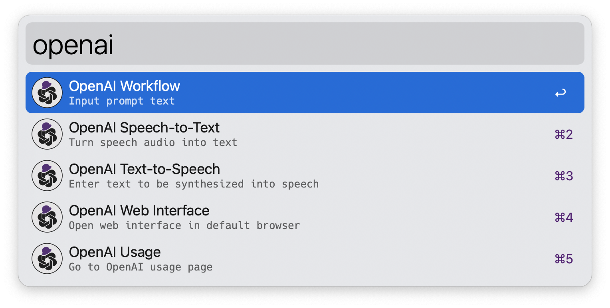
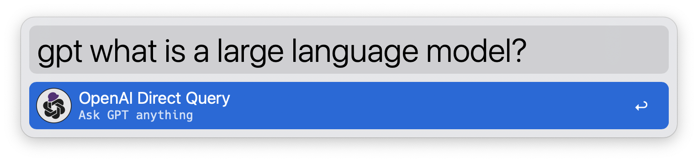

# OpenAI Chat API Workflow for Alfred


🎩 An [Alfred 5](https://www.alfredapp.com/) Workflow for using [OpenAI](https://beta.openai.com/) Chat API to interact with GPT-3.5/GPT-4 🤖💬 It also allows image generation 🖼️, speech-to-text conversion 🎤, and text-to-speech synthesis 🔈



<kbd></kbd>

**Note**: The web interface is built by the workflow and run locally within your Mac. The API call is made directly between the workflow and OpenAI, so you don't need to worry about your chat messages being shared online with anyone other than OpenAI. Additionally, OpenAI does not use the data from the API Platform for [training](https://openai.com/enterprise-privacy).

## ⬇️ Downloads

📦 [**Download Workflow**](https://github.com/yohasebe/openai-chat-api-workflow/raw/main/openai-chat-api.alfredworkflow)

In `2.7`, MPV-based text-to-speech stream playback was introduced; MPV can be installed with `brew install mpv`.

**Installation**

1. Install [Homebrew](https://brew.sh/)
2. Run the following command in a terminal: `brew install pandoc mpv sox jq duti`
3. Download and run the [workflow](https://github.com/yohasebe/openai-chat-api-workflow/raw/main/openai-chat-api.alfredworkflow)

**Recent Change Log**

- 2.8.3: Loopback address for web UI can be chosen from `127.0.0.1` or `localhost`
- 2.8.0: Web UI hosted by a server running within workflow
    - Several usability improvements
    - Bug fixes in the automatic speech-to-speech feature
- 2.7.2: Improved streaming TTS playback
    - Requires `brew install mpv`
    - Works on Chrome, Edge, and Safari
    - "Set Voice" button added
    - "Auto Play" button added

[Complete Change Log](https://github.com/yohasebe/openai-chat-api-workflow/blob/main/CHANGELOG.md)

## 🔁 Dependencies

- Alfred 5 [Powerpack](https://www.alfredapp.com/shop/)
- OpenAI [API key](https://platform.openai.com/account/api-keys)
- [Pandoc](https://pandoc.org/): to convert Markdown to HTML
- [MPV](https://mpv.io/): to play text-to-speech audio stream
- [Sox](https://sox.sourceforge.net/sox.html): to record voice input
- [jq](https://jqlang.github.io/jq/): to handle chat history in JSON
- [duti](https://github.com/moretension/duti): to use Google Chrome or Microsoft Edge to open web interface

To start using this workflow, you must set the environment variable `apikey`, which you can get by creating a new [OpenAI account](https://platform.openai.com/account/api-keys). See also the [Configuration](#configuration) section below.

You will also need to install the `pandoc` and `sox` programs. Pandoc will allow this workflow to convert the Markdown response from OpenAI to HTML and display the result in your default web browser with syntax highlighting enabled (especially useful when using this workflow to generate program code). Sox will allow you to record voice audio to convert to text using Whisper speech-to-text API.

Installing dependencies (`pandoc`, `mpv`, `sox`, `jq`, and `duti`) is just a few clicks once this workflow has been included in the [Alfred Gallery](https://alfred.app/). For now, install these programs using [homebrew](https://brew.sh/). Once homebrew is installed, run the following command.

```shell
  brew install pandoc mpv sox jq duti
```

## ⚡️ Simple Direct Query/Chat

To quickly chat with GPT:

- Method 1: Type keyword `gpt` → space/tab → input query text (e.g. "**gpt** what is a large language model?")
- Method 2: set up a custom hotkey to `OpenAI Direct Query`



## ⚙️ Additional Query Methods

### ⌨️ Via Alfred's Textbox

You can enter a query text directly into Alfred textbox:

- Method 1: Alfred textbox → keyword (`openai`) → space/tab → input query text → select a command (see below)
- Method 2: Alfred textbox → input query text → select fallback search (`OpenAI Query`)

### 📋 Using Selected Text

You can select any text on your Mac and send it to the workflow:

- Method 1: select text → universal action hotkey → select `OpenAI Query`
- Method 2: set up a custom hotkey to `Send selected text to OpenAI`

### 🌐 Via Web Interface

You can open a web interface

- Method 1: Alfred textbox → keyword (`openai-webui`)
- Method 2: set up a custom hotkey to `Open web interface`

**Using Google Chrome**

If your default browser is Google Chrome and "duti" command is installed to the system, the web interface will be opened by Google Chrome. Otherwise, Safari will be used.

**Web UI Modes**

Switch modes (light/dark/auto) with `Web UI Mode` selector in the settings.

<kbd></kbd>

<kbd></kbd>

## Commands

The input text is used as a prompt to the OpenAI Chat API. The original input text can be prepended or postfixed with instructional text to compose a complex query to be given to the API.

#### <span></span> Direct Query

The input text is directly sent as a prompt to the OpenAI Chat API.

<kbd></kbd>

#### <span></span> Prepend Text + Query

After the initial text is entered, the user is prompted for additional text. The additional text is added *before* the initial text, and the resulting text is used as the query.

<kbd></kbd>

#### <span></span> Append Text + Query

After the initial text is entered, the user is prompted for additional text. The additional text is added *after* the initial text and the resulting text is used as the query.

#### <span></span> Generate Image

<kbd></kbd>

The DALL-E API (`dall-e-3` or `dall-e-2`) is used to generate images according to the prompts entered. In general, the more detailed the prompt, the closer the content and quality of the output image will be to what is desired. 

> Rugby players are playing in a match using a watermelon as a ball

<kbd></kbd>

#### <span></span> Write Program Code

GPT will generate program code and example output according to the text entered. Specify the purpose of the program, its function, the language and technology to be used, etc.

**Example Input**

> Create a command line program that takes an English sentence and returns syntactically parsed output. Provide program code in Python and example usage.

**Example Output**

<kbd></kbd>

## Specialized Commands

These commands primarily utilize OpenAI's recommended uses for the Chat API. Note: User-specified values for the following settings are disregarded when executing these commands:

- `temperature`
- `frequency_penalty`
- `presence_penalty`

### Language-related

#### <span></span> Ask in Your Language 

You can ask questions in the language set to the variable `first_language`. 

**Note**: If the value of `first_language` is not `English` (e.g. `Japanese`), the query may result in a more or less inaccurate response.

#### <span></span> Translate L1 to L2 

Translate text in the language specified in the variable `first_language` to the language specified in the `second_language`.

#### <span></span> Translate L2 to L1 

Translate text in the language specified in the variable `second_language` to the language specified in the variable `first_language`.

#### <span></span> Grammar Correction

Correct sentences into standard English. See OpenAI's [description](https://beta.openai.com/examples/default-grammar).

### Idea-related

#### <span></span> Brainstorm

Brainstorm some ideas about a given text.

#### <span></span> Create Study Notes

Provide a topic and get study notes. See OpenAI's [description](https://beta.openai.com/examples/default-study-notes) for this example.

#### <span></span> Analogy Maker 

Create analogies. See OpenAI's [description](https://beta.openai.com/examples/default-analogy-maker) for this example.

#### <span></span> Essay Outline 

Generate an outline for a research topic. See OpenAI's [description](https://beta.openai.com/examples/default-essay-outline) for this example.

### Summarization-related

#### <span></span> TL;DR Summarization 

Summarize text by adding a 'tl;dr:' to the end of a text passage. See OpenAI's [description](https://beta.openai.com/examples/default-tldr-summary) for this example.

#### <span></span> Summarize for a 2nd Grader 

Translates complex text into more straightforward concepts. See OpenAI's [description](https://beta.openai.com/examples/default-summarize) for this example.

#### <span></span> Keywords

Extract keywords from a block of text. See OpenAI's [description](https://beta.openai.com/examples/default-keywords) for this example.


## Text-to-Speech Synthesis

Text entered or response text from GPT can be read out in a natural voice using OpenAI's text-to-speech API.

## Speech-to-Text Conversion 

<kbd></kbd>

The Whisper API can convert speech into text in a variety of languages. Please refer to the [Whisper API FAQ](https://help.openai.com/en/articles/7031512-whisper-api-faq) for available languages and other limitations.

### Audio File to Text

You can select an audio file in `mp3`, `mp4`, `flac`, `webm`, `wav`, or `m4a` format (under 25MB) and send it to the workflow:

Select the file → universal actioin hotkey select → `OpenAI Speech-to-Text`

### Record Voice Audio and Transcribe

Alternatively you can record voice audio and send it to the Workflow for transcription using the Whisper API. The recording must be no longer than 30 minutes and will automatically stop after this time. Recording time is limited to 30 minutes and stops automatically after this limit.

<kbd></kbd>

- Alfred textbox → keyword (`openai-speech`) → Terminal window opens and recording starts
- Speak to internal or external microphone → Press Enter to finish recording
- Choose processes to apply to the recorded audio

  - transcribe (+ delete recording)
  - transcribe (+ save recording to desktop)
  - transcribe and query (+ delete recording)
  - transcribe and query (+ save recording to desktop)
  - exit (+ delete recording)
  - exit (+ save recording to desktop)

You can choose the format of the transribed text from `text`, `srt` or `vtt` in the workflow's settings. Below are examples in the `text` and `srt` formats:

<kbd></kbd>

<kbd></kbd>

## Monitoring API Usage 

To review your token usage for the current billing cycle on the OpenAI Usage Page, type the keyword `openai-usage`. For more details on billing, visit OpenAI's [Billing Overview](https://platform.openai.com/account/billing/overview).

## Configuration 

### Required Settings

- **OpenAI API Key**: Set your secret API key for OpenAI. Sign up for OpenAI and get your API key at [https://platform.openai.com/account/api-keys/](https://platform.openai.com/account/api-keys).

- **Base URL**: The base URL of the OpenAI Chat API. (default: `https://api.openai.com/v1`)

- **Streaming**: Show results in the default web browser. If unchecked, Alfred's "Large Type" feature is used to display the result. (default: `enabled`)

### Chat Parameters

- **Model**: OpenAI's chat [model](https://beta.openai.com/docs/api-reference/models) used for the workflow (default: `gpt-3.5-turbo`). Here are the models currently available:

  - `gpt-3.5-turbo-1106`
  - `gpt-3.5-turbo`
  - `gpt-3.5-turbo-16k`
  - `gpt-4-1106-preview`
  - `gpt-4`

- **Max Tokens**: See OpenAI's [documentation](https://beta.openai.com/docs/api-reference/chats/create#chats/create-max_tokens). (default: `2048`)
- **Temperature**: See OpenAI's [documentation](https://beta.openai.com/docs/api-reference/chats/create#chats/create-temperature). (default: `0.3`)
- **Top P**: See OpenAI's [documentation](https://beta.openai.com/docs/api-reference/chats/create#chats/create-top_p). (default: `1.0`)
- **Frequency Penalty**: See OpenAI's [documentation](https://beta.openai.com/docs/api-reference/chats/create#chats/create-frequency_penalty). (default: `0.0`)
- **Presence Penalty**: See OpenAI's [documentation](https://beta.openai.com/docs/api-reference/chats/create#chats/create-presence_penalty). (default: `0.0`)
- **Memory Span**: Set the number of past utterances sent to the API as a context. Setting 4 to this parameter means 2  conversation turns (user + assistant) will be sent as a context for a new query. The larger the value, more tokens will be consumed. (default: `4`)
- **Add Emoji**: If enabled, the response text from GPT will contain emoji characters appropriate for the content. This is realized by adding the following sentence at the end of the system content. (default: `enabled`)

> Add emojis that are appropriate to the content of the response.

### Image Generation Parameters

- **Image Generation Model**: `dall-e-3` and `dall-e-2` are available. (default `dall-e-3`)
- **Image Size** (`for dall-e-3`): Set the size of images to generate from `1024x1024`, `1024x1792`, `1792x1024`. (default: `1024x1024`)
- **Quality** (`for dall-e-3`): Choose the quality of image from `standard` and `hd`. (default: `standard`)
- **Style** (`for dall-e-3`): Choose the style of image from `vivid` and `natural`. (default: `vivid`)
- **Number of Images** (for `dall-e-2`) : Set the number of images to generate in image generation mode from `1` to `10`. (default: `1`)
- **Image Size** (for `dall-e-2`): Set the size of images to generate from `256x256`, `512x512`, `1024x1024`. (default: `256x256`)

### Text-to-Speech Parameters

- **Text-to-Speech Model**: One of the available TTS models: `tts-1` or `tts-1-hd`. (default: `tts-1`)
- **Text-to-Speech Voice**: The voice to use when generating the audio. Supported voices are: `alloy`, `echo`, `fable`, `onyx`, `nova`, and `shimmer`. (default: `alloy`)
- **Text-to-Speech Speed**: The speed of the generated audio. Select a value from 0.25 to 4.0. (default: `1.0`)

### Speech-to-Text Parameters

- **Transcription Format**: Set the format of the text transcribed from the microphone input or audio files from `text`, `srt`, or `vtt`. (default: `text`)
- **Processes after Recording** Set the default choice of what processes follow after audio recording finishes (default: `transcribe [+ delete recording]`).
 
  - Transcribe [+ delete recording]
  - Transcribe [+ save recording to desktop]
  - Transcribe and query [+ delete recording]
  - Transcribe and query [+ save recording desktop]

- **Audio to English**: When enabled, Whisper API will transcribe the input audio and output text translated into English. (default: `disabled`)

### Optional Settings

- **Your First Language**: Set your first language. This language is used when using GPT for translation. (default: `English`)
- **Your Second Language**: Set your second language. This language is used when using GPT for translation.(default: `Japanese`)
- **Max Characters**: Maximum number of characters that can be included in a query (default: `20000`).
- **Timeout**: The number of seconds (default: `10`) to wait before opening the socket and connecting to the API. If the connection fails, reconnection (up to 20 times) will be attempted after 1 second.
- **Sound**: If checked, a notification sound will play when the response is returned. (default: `disabled`)
- **Save File Path**: If set, the results will be saved in the specified path as a markdown file. (default: `not set`)
- **Text to Speech**: If enabled, the results will be read aloud using the system's default text-to-speech language and voice. (default: `disabled`)
- **Custom CSS**: You can specify CSS for the query results HTML. (default: `not set`)
- **Web UI Mode**: Set your preferred UI mode (`light`/`dark`/`auto`). (default: `auto`)
- **System Content**: Text to sent with every query sent to API as a general information about the specification of the chat. The default value is as follows:

> You are a friendly but professional consultant who answers various questions, make decent suggestions, and give helpful advice in response to a prompt from the user. Your response must be consise, suggestive, and accurate. 

## Author

Yoichiro Hasebe (<yohasebe@gmail.com>)

## License

The MIT License

## Disclaimer

The author assumes no responsibility for any potential damages arising from the use of this software.
